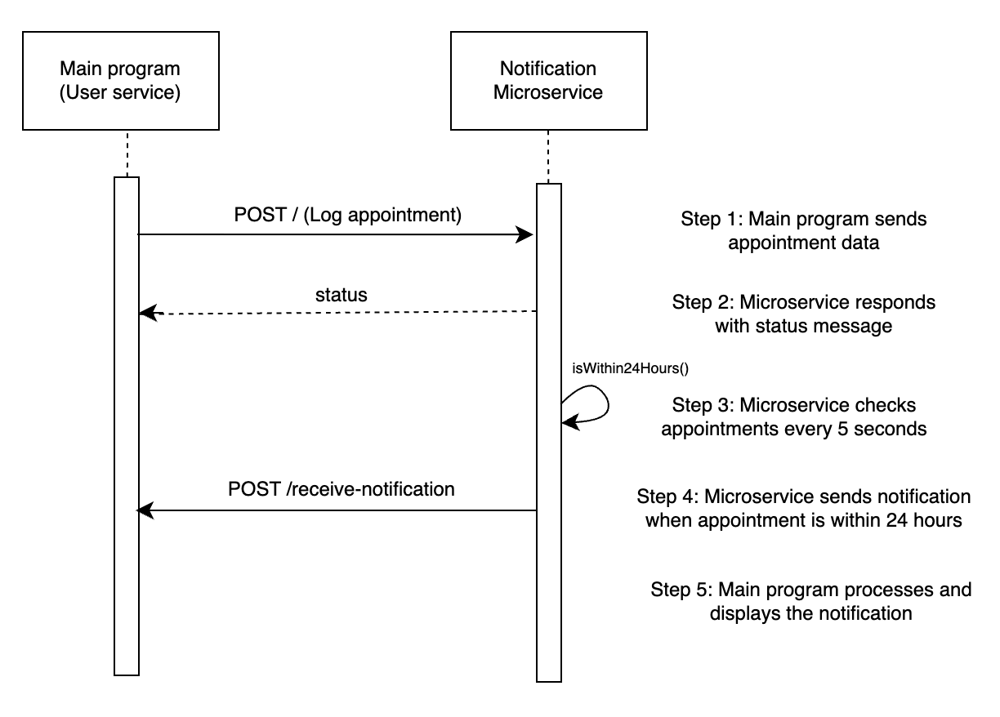

# Microservice A: Notification Service

This microservice is designed to log appointments that the main program sends to it (request), sending a confirmation/error message (response). When appointments are within 24 hours of the current date, the microservice will send the appointment back out to the main program, which the main program can use to display the notification as necessary.

## Communication Contract

### How to REQUEST data (log appointment)
Send a POST '/' request to the microservice

Default port for microservice is defined as `http://localhost:3001/`.

The request body must follow the format:
```
{
    "user_id": "alphanumeric string",
    "appointment": {
        "date": "YYYY-MM-DD",
        "time": "HH:mm",    // 24-hour format
        "vet_name": "string"
    }
}
```

Example call:
```
const validData = {                                 // Example request body
        "user_id": "user123",
        "appointment": {
            "date": "2024-12-25",
            "time": "13:00",
            "vet_name": "Dr. Jane Doe"
        }
    };

try {
    const response = await axios.post(MICROSERVICE_URL, validData);     // Example call
} catch (error) {
    // Error handling here
}
```

### How to RECEIVE data

The microservice will automatically send JSON response objects to the main program when stored appointments reach the 24 hour window, acting as a notification system.
The microservice will also send back status messages on attempts to log appointments.

Default port for the main program is defined as `http://localhost:3000/`, and the microservice will POST the notifications to the main program at `http://localhost:3000/receive-notification`.

The main program must have an endpoint (in my example, it is at POST `/receive-notification`) to receive notifications from the microservice:
```
app.post('/receive-notification', (req, res) => {
    console.log('Main service received notification:', req.body);
    // code here to display notification
    res.status(200).json({ status: 'success', message: 'Notification received' });
});
```

#### Status Message
Example valid response body (sent by microservice):
```
{
    status: 'success',
    message: 'Notification logged successfully',
    appointment_details: {
        user_id: 'user123',
        date: '2024-11-25',
        time: '11:00',
        vet_name: 'Dr. Jane Doe'
  }
}
```

Example invalid response body (sent by microservice):
```
{
    status: 'error',
    message: 'Appointment must be scheduled in the future.'
}
```

#### Notification
The body of the JSON request object sent by the microservice contains the notification that is to be displayed by the main program. This JSON object will include:
* Status (success/error) and status message
* Appointment details: user id, date, time, vet name

Example notification (request body, automatically sent by microservice to the main program):
```
{
    status: 'success',
    message: 'Notification sent successfully',
    user_id: 'user123',
    appointment_details: { date: '2024-11-20', time: '13:00', vet_name: 'Dr. Jane Doe' }
}
```

## UML Sequence Diagram
